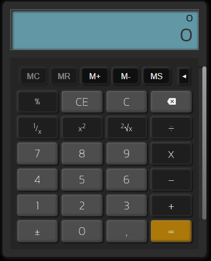

<h1 style="text-align: center; color:#ACACAC"> Portfolio Web :bookmark_tabs: </h1>

 
    

 

Proyecto donde muestro mis más recientes trabajos, así como mis habilidades.
 
V2.0

------------
<h2 style="color:#99CC99" >Tecnologías Utilizadas:</h2>

        
        
        
        
        

----
<h2 style="color:#99CC99" >About:</h2>
